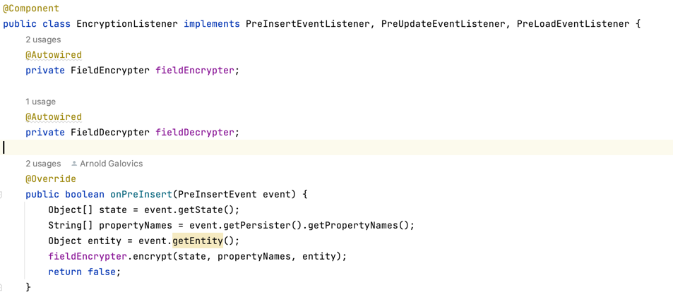
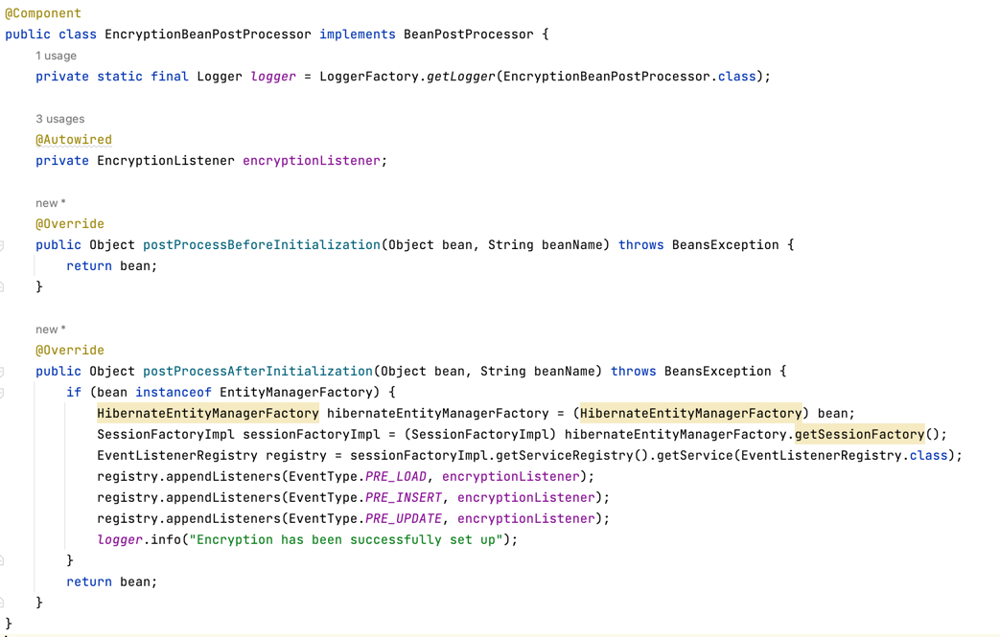

해당 레포는, [hibernate-encryption-listener](https://github.com/galovics/hibernate-encryption-listener) 의 레포를 포크해서 내스타일의 코드와 테스트 방식으로 약간 업데이트 한 레포이다.
암호화 방식들을 리서치 하다가 [블로그](https://blog.arnoldgalovics.com/jpa-entity-encryption/) 작성자가 소개한 코드가 좋아 해당 레포를 작업하게 되었다.

아래 3가지 방식중에서 어떤걸 선택할지 고민이었다.

1. EntityListener 방식
2. Hibernate EventListener 방식
3. ~~AttributeConverter방식~~  // <- 얘는 1개의 필드에 관여하는데 적합하다. 키를 계속 변경하면서 업데이트 해줘야하는 우리의 방식에 맞지 않아 소개하지 않는다.

사실 블로그에서도 고민을 잘 다루고 있고, 2번을 선택했고 꽤 일리 있는 근거들이었다.
그런데 나에겐 훨씬 중요한 포인트가 더티체킹에 의한 update 발생 유무이다.

- 1번 방식은 get만 했는데도 복호화 처리로 인해 더티체킹으로 간주되어 update가 발생한다.
- **2번 방식은 update가 발생하지 않는다.**

`EntityListener 방식`과 `Hibernate EventListener 방식`을 간단하게 비교해 본다. (코드는 커밋으로 나뉘어져 있다)

## EntityListener 방식
`javax.persistence` 사용.
엔티티에 `@EntityListeners` 를 추가 해주면 `@PrePersist, @PostLoad` 등의 어노테이션으로 후킹할수가 있다.

### 장점
- 후킹했을때 들어오는 인자가 엔티티라 읽기가 쉽다.

### 단점
- **get 만 했는데 update가 발생한다** (복호화 때문에 더티체킹 발생)
- 이를 극복하려면 transient 필드를 추가 관리 해야한다. 
- 코드작성 실수를 유발할수 있다.

## Hibernate EventListener 방식
`org.hibernate.event.spi` 사용.
`PreInsertEventListener, PreUpdateEventListener, PreLoadEventListener` 를 구현한, 이벤트리스너를 작성하는 방식 이다.

다음과 같이 EventListenerRegistry에 등록하면 된다.

### 장점
- **update가 발생하지 않는다.**
- 모두 완전 자동화되어 실수를 유발하지 않는다.

### 단점
- 비교적 코드가 복잡하다